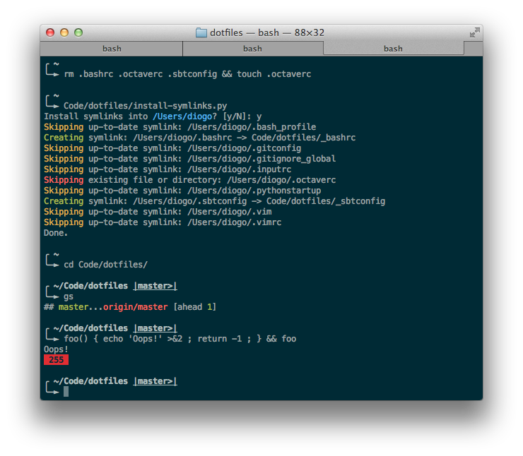

dotfiles
========

Installation
------------

Choose your adventure.

### The Quick Way

    $ git clone git://github.com/diogocampos/dotfiles.git
    $ dotfiles/setup.sh

### The Manual Way

1. Clone the repo:

        $ git clone git://github.com/diogocampos/dotfiles.git somewhere
        $ cd somewhere

2. Install the submodules:

        $ git submodule update --init --recursive

3. Install the symlinks:

        $ ./install-symlinks.py path/to/target/dir

The `install-symlinks.py` script asks for confirmation before creating symlinks
in a directory of your choice, defaulting to `$HOME`.  **Conflicting symlinks
will be overwritten**, but existing files and directories will not be affected.

You can preview all the changes without applying them by using the
`-d`/`--dry-run` flag:

    $ ./install-symlinks.py [target] --dry-run

To see all the options supported by the script, run:

    $ ./install-symlinks.py --help

Gratuitous screenshot
---------------------

Thanks
------

* [Drew Neil][nelstrom] and his excellent [Vimcasts][vimcasts]
* [Tim Pope][tpope]'s awesome [Vim plugins][tpope-repos]
* [dotfiles.github.io](http://dotfiles.github.io/)

[nelstrom]: https://github.com/nelstrom/
[tpope]: https://github.com/tpope/
[tpope-repos]: https://github.com/tpope?tab=repositories
[vimcasts]: http://vimcasts.org/
